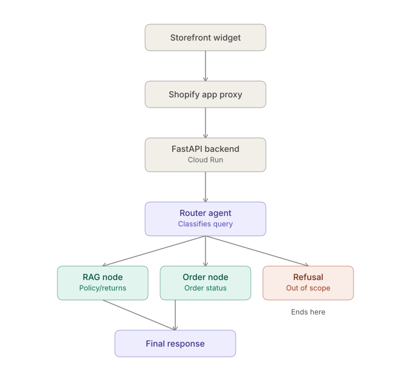

The product is a customer support chatbot for my client's ecommerce store. It's chat widget is embedded directly into the storefront, while the backend that powers it runs separately, hosted on Cloud Run. It answers store policy questions (returns, shipping, etc.) and looks up order status for logged-in customers, including combined queries like "can I return order #1234" where it checks both the relevant policy and the order details before responding. It also keeps context across a conversation, so customers can ask follow-up questions without repeating themselves.

High Level Architecture

Decision Making

Why a routing architecture, not a single LLM
Different customer queries need fundamentally different handling — a policy question needs retrieval, an order question needs a live API call, and some need both. A single LLM trying to do all of this in one call doesn't cleanly separate those concerns, so the design went straight to a router that dispatches to the right path (with parallel execution when a query needs both RAG and order data), rather than starting simple and refactoring later.

The embeddings back-and-forth
Embeddings went through three iterations before landing on the current setup:

Started with local embeddings (FastEmbed): ran into memory limits, since Cloud Run was only provisioned with 500MiB.
Switched to Vertex AI's embeddings API to sidestep the memory issue, but that introduced high per-request latency, confirmed by tracing requests through LangSmith.
Reverted to local embeddings (FastEmbed) and increased the Cloud Run instance to 1GB of memory — solving the original memory constraint without reintroducing the latency cost of an API call.

Local embeddings' accuracy hasn't been rigorously benchmarked yet — the decision was driven by latency, not a quality comparison.

History size and TTL are provisional, not tuned
The 20-message cap and 2-minute TTL came out of a client conversation, not load testing: given the store's small scale, the client expects short conversations and short customer dwell time on the storefront, so a small history window made sense as a starting point. These numbers are still being validated in practice and may change once real usage data comes in.

COMPONENT BREAKDOWN
Knowledge base
The policy knowledge base is built from FAQ-based document ingestion store policy docs are chunked and embedded locally, then stored in a local vector store (Chroma). Since embeddings are generated locally rather than through an API, ingestion and retrieval avoid the added latency and cost of external embedding calls.

Frontend (Shopify theme app extension)
The chat widget is built as a Shopify theme app extension client-side JavaScript embedded directly into the storefront theme. It renders the chat UI and handles user input. For logged-in customers, it passes their logged_in_customer_id as a URL parameter to the Shopify App Proxy, which the backend uses to identify the customer and key their conversation history. Guests can still use the widget, but without persisted history across messages.

App Proxy
Shopify's App Proxy sits between the storefront widget and the FastAPI backend. It forwards the widget's requests including the logged_in_customer_id to the backend hosted on Cloud Run. Since requests are routed through Shopify's own domain rather than calling Cloud Run directly from the browser, it also acts as a CORS bridge, meaning the backend doesn't need to configure CORS itself.

Backend (FastAPI on Cloud Run)
The backend is a FastAPI application deployed on Cloud Run. It's async end-to-end, any CPU-bound work is offloaded to a worker thread so the event loop stays unblocked. The LangGraph workflow is compiled lazily on the first incoming request and then reused for all subsequent requests.

Router agent
The entry point of the graph. It uses an LLM (via ChatGroq) with structured output to classify each incoming message and decide which path to take: a store-policy question, an order-related question, both (for combined queries like "can I return order #1234"), or out-of-scope.

RAG node(policy questions)
Handles store-policy questions using retrieval-augmented generation. Store policy documents are embedded(local ) into a local vector store (Chroma), and relevant chunks are retrieved and passed to the LLM to generate a grounded answer.

Order Node
Handles order-related questions. It calls Shopify's GraphQL Admin API asynchronously to fetch order details using email address and order number provided by the customer in the query.

Final response node
Combines results from the RAG and Order nodes into a single reply. If only the RAG path ran, its answer is returned as-is. If the Order path ran either alone or alongside RAG (combined queries), both results are fed to an LLM to synthesize into one coherent response.

Chat historyThree LLM providers, not one
The project is currently bottlenecked at roughly 30 requests/minute on a single provider's free tier. Spreading the three LLM-calling nodes across three different providers (rather than three models from the same provider) means no single node is capped by one provider's rate limit — effectively multiplying available throughput. Models are also assigned by role: the router uses qwen, the smallest/fastest of the three, since routing decisions need to be quick; RAG and final-response generation each use a separate OpenAI model.
Conversation history is kept in a plain Python dictionary, keyed by logged_in_customer_id, guests don't get persisted history. Each entry is capped at 20 messages (10 turns) and expires after 2 minutes of inactivity via manual TTL checks. Keeping history means customers don't have to repeat details they've already given earlier in the conversation. Staleness isn't a concern for this short window either, order and policy data typically only change on the scale of hours to days, far slower than the 2-minute TTL. No external database (e.g. Redis) is used; given short conversations (10-15 messages) and the demo scope of this project, an in-memory store keeps the architecture minimal. Concurrency handling for simultaneous requests to the same customer's history is intentionally left unaddressed, since the short TTL makes this a low-risk edge case in practice.

Future additions

Guardrails not yet implemented; planned once the client schedules the product launch on the live site, which will also allow for real usage data collection to inform what guardrails are actually needed.
Semantic caching planned to reduce redundant LLM calls, but the exact scope is left undecided until real usage data reveals where the actual bottlenecks are. Known open question: order queries are tricky to cache safely, since near-identical phrasing with a different order number (e.g. "where's order #1001" vs "where's order #5678") could otherwise return the wrong customer's data so whether/how to cache them will depend on what the data shows.